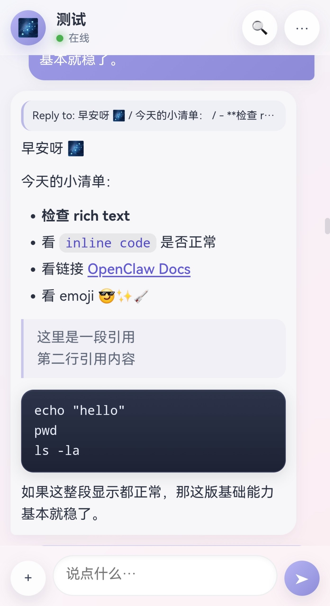
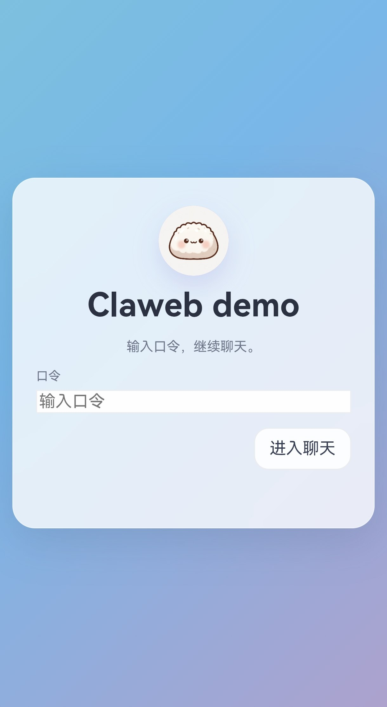

# claweb

[English](./README.md) | [简体中文](./README.zh-CN.md)


**CLAWeb is a client-facing OpenClaw channel for web-style chat entry, with a browser reference client and a reference access host.**

It keeps routing, session flow, reply flow, and memory strategy inside OpenClaw, while exposing a client-facing surface that can be consumed by web, app, desktop, or other clients.

If you are evaluating the project for the first time, the shortest useful summary is:

- **OpenClaw** owns routing, prompts, memory, and agent behavior
- **CLAWeb** defines the client-facing contract
- **`access/frontdoor/`** is the reference host for `/login`, `/history`, and `/ws`
- **`clients/browser/`** is the first reference client, not the full product boundary

## Why CLAWeb exists

CLAWeb is for the gap between:
- OpenClaw's internal runtime / agent world
- client applications that need login, history, realtime messaging, reply rendering, and media handoff

In other words:
- OpenClaw owns routing, prompts, memory, and agent behavior
- CLAWeb owns the client-facing channel contract and reference implementations

## What this repository contains

- **Channel runtime** in `src/`
- **Reference access layer** in `access/frontdoor/`
- **Browser reference client** in `clients/browser/`
- **Example configs / sample data** in `examples/`
- **Architecture / contract / integration docs** in `docs/`

## Current validated scope (`v0.2.0`)

The current repository baseline already validates:

- `hello -> ready -> message` websocket flow
- browser-side normalization and dedupe for realtime + history replay
- stable history replay ordering (`ts`, `_idx`)
- reply linking and compact reply preview fallback
- safe-subset rich text rendering in the browser client
- session persistence and automatic reconnect after refresh / background interruption
- image upload flow with “keep original by default” behavior and oversized-image compression fallback
- OpenClaw-standard media handoff compatibility (`MEDIA:` / `mediaUrl`)

## Screenshots

### Chat interface



### Login / entry



## Explicit non-goals

This repository does **not** currently own:

- persona / prompt logic
- memory injection strategy
- Telegram or other private adapters
- full production auth / ops hardening
- arbitrary raw HTML or executable rich content
- video-generation or business-logic orchestration inside CLAWeb itself

## Repository map

### 1) Channel runtime
- `index.ts`
- `src/`

This is the actual CLAWeb channel layer inside OpenClaw.

### 2) Reference access layer
- `access/frontdoor/`

This is the reference host for `/login`, `/history`, and `/ws`.
It is not the channel runtime itself.

### 3) Reference clients
- `clients/browser/`

This is the first browser reference client.
It should not be treated as the whole boundary of CLAWeb.

### 4) Examples
- `examples/openclaw.config.example.jsonc`
- `examples/claweb-login.example.json`

This directory is for example configs and sample data only.

## Quick start

If you are new to CLAWeb, start here first:

- **Step-by-step setup guide:** [`docs/setup-guide.md`](./docs/setup-guide.md)
- **Troubleshooting:** [`docs/troubleshooting.md`](./docs/troubleshooting.md)

The shortest local path is:

1. Install dependencies:
   ```bash
   npm install
   npm run typecheck
   ```
2. Install and enable the plugin in OpenClaw:
   ```bash
   openclaw plugins install /path/to/claweb --link
   openclaw plugins enable claweb
   ```
3. Configure `channels.claweb` using [`examples/openclaw.config.example.jsonc`](./examples/openclaw.config.example.jsonc).
4. Start the reference access host in [`access/frontdoor/`](./access/frontdoor/).
5. Open the browser UI and verify the canonical routes:
   - `GET /`
   - `POST /login`
   - `GET /history`
   - `WS /ws`

Compatibility aliases may also exist:
- `POST /claweb/login`
- `GET /claweb/history`
- `WS /claweb/ws`

## Start here in the docs

- Setup guide (step-by-step): [`docs/setup-guide.md`](./docs/setup-guide.md)
- Troubleshooting: [`docs/troubleshooting.md`](./docs/troubleshooting.md)
- Architecture: [`docs/channel-architecture.md`](./docs/channel-architecture.md)
- Channel contract: [`docs/channel-contract.md`](./docs/channel-contract.md)
- Browser client integration: [`docs/browser-client-integration.md`](./docs/browser-client-integration.md)
- Project scope: [`docs/project-scope.md`](./docs/project-scope.md)
- Docs index: [`docs/README.md`](./docs/README.md)
- Regression checklist: [`docs/regression-checklist.md`](./docs/regression-checklist.md)
- State model: [`docs/state-model.md`](./docs/state-model.md)

If you want the best current high-level summary of where the project stands, read:
- [`docs/project-status.md`](./docs/project-status.md)

## Public release position

- The repository is public-source oriented and currently tracked at the `0.2.x` milestone.
- GitHub releases/tags are appropriate.
- npm publishing is intentionally not enabled.
- `package.json` keeps `"private": true` to prevent accidental npm publish.

## Security notes

- Never commit real passphrases, tokens, or user mapping files.
- Keep only placeholder/example values in Git.
- Prefer local binding (`127.0.0.1`) until explicit network hardening is in place.
- See [`SECURITY.md`](./SECURITY.md).

## License

Apache-2.0
